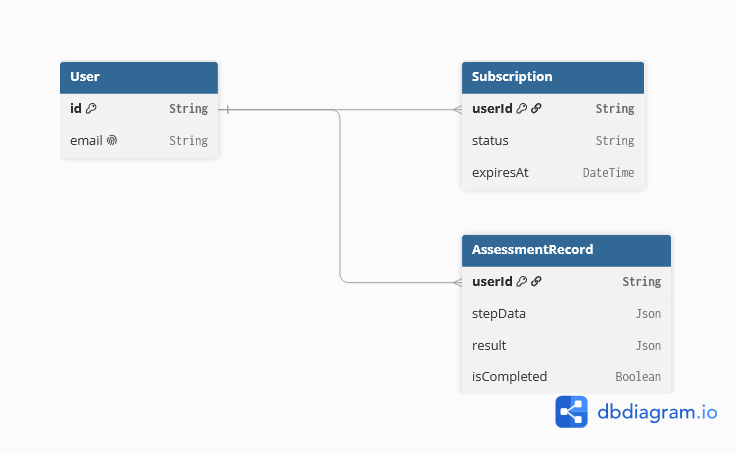

# 健康测评系统 Health Assessment System
## 项目概述
本项目基于 Next.js 14 App Router + TypeScript + Prisma + Supabase PostgreSQL 开发，完整实现一套面向女性用户的健康体重测评全链路后端架构，配套轻量化交互前端，完整覆盖试题四大核心阶段：**分步数据持久化、后端健康算法计算、订阅会员鉴权、自动化边界测试**。

> 部署说明：海外PaaS平台账号相关限制，暂时无法完成线上公网部署；项目完整代码、本地全流程可复现，配套可视化交互前端，无需Postman即可完整演示业务闭环。

---

## 一、项目完整演示指南（浏览器直接操作，无需接口工具）
系统默认预置女性测试用户数据：22岁/162cm/55kg，目标体重52kg，中等运动强度，打开首页自动填充，支持自定义修改参数。
### 完整业务流程闭环
1. **分步填写&自动持久化**
页面表单修改任意数据，提交测评接口自动增量存储测评记录；刷新页面后重新进入，可基于固定测试用户恢复全部已填写进度。
2. **分层前端输入校验（多层边界拦截）**
    1. 优先校验空白项：性别/运动频率未选择时，直接拦截提交，提示「输入完整信息后才可生成检测报告」；
    2. 无空白字段后，再校验数值边界，满足以下任意条件则提示「请输入有效信息」：
       - 年龄、身高、当前体重、目标体重为非正数值（负数、标点、文字等）；
       - 当前体重与目标体重数值完全一致（无测评意义）；
    前端提前拦截非法参数，减少无效接口请求。
    注：并未拦截目标体重高于当前体重情况，权作娱乐性计算。
3. **提交测评，后端算法计算**
点击「提交测评计算报告」，后端执行健康评估算法，自动计算BMI、每日推荐热量、目标减重日期，计算结果持久存入数据库测评记录表。
4. **免费用户权限拦截，数据脱敏**
初始用户为免费订阅状态，点击「查看我的测评报告」，接口自动脱敏隐藏热量、目标日期核心数据，文案提示开通会员解锁完整报告。
5. **模拟支付升级会员（重复调用状态拦截）**
点击「模拟开通会员」调用 `/api/pay` 支付回调接口：
    - 免费用户首次点击：更新数据库订阅状态为 `active`，提示支付成功；
    - 已开通会员重复点击：直接返回提示「您已经是尊贵会员！无需重复开通」，不重复更新数据库。
6. **一键重置订阅状态（可反复演示对比）**
点击「重置为免费用户」接口，强制将订阅状态改回免费，可循环演示付费前后差异化返回效果；
注：此功能设计逻辑是面向考官进行简易测试。实际面向用户展示时应当隐藏。
7. **实时会员状态可视化展示**
页面右上角常驻会员状态标签，文字前置空格优化排版，无需手动查看报告即可实时识别当前身份：
    - 免费用户：标签显示「会员状态：非会员」
    - 付费会员：标签显示「会员状态：尊贵会员（30天有效期）」
执行开通会员、重置免费用户操作后，状态标签自动同步刷新，直观展示订阅状态变更。
注：有效期天数目前仅做参考展示，预留实时计时拓展空间。
8. **一键清空表单功能（放置所有按钮最底部）**
页面最下方按钮组最末尾提供「清空全部填写数据」按钮，一键重置所有输入框、下拉选择项，清空同时隐藏测评报告，提示用户重新填写完整测评信息。
任意功能按钮触发时自动清空当前展示的测评报告，交互逻辑贴合用户直觉。

### 前端迭代新增输入约束补充（迭代优化内容，不改动原有业务逻辑）
9. **输入长度与字符差异化校验迭代过程**
    1. 初始方案：数字输入框添加`maxLength="5"`限制5位数字，发现`type="number"`原生不支持该属性，方案废弃；
    2. 迭代方案一：前端输入实时正则过滤，区分年龄仅允许数字、身高体重允许数字+单个小数点；测试发现删除超长数字后输入框空白仍会残留非法数值标记，提示文案冲突；
    3. 最终定型方案：移除输入实时字符拦截，放开输入框自由输入权限（支持文字、符号、负数、小数），仅在点击提交按钮时统一分层校验；
    4. 分层校验细分规则：
       - 空白校验优先级最高：性别/运动频率未选、任意输入框空白，提示「输入完整信息后才可生成检测报告」；
       - 数值差异化校验：年龄必须为1~99999纯整数（禁止小数）；身高、当前体重、目标体重支持1~99999整数/合法小数；文字、负数、0、超限大数、体重相等统一判定非法，提示「请输入有效信息」；
    5. 代码兼容修复：统一表单存储类型为字符串，校验前强制转换字符串执行`.trim()`，修复数字类型无trim方法导致的页面报错，支持身高`55.3`、`160.5`等小数正常提交校验。
10. **页面布局对齐优化**
原提交按钮单独一行、功能按钮三列网格，左右边距不一致视觉错位；统一全部按钮放入`grid grid-cols-4`四列网格容器，提交按钮使用`col-span-4`独占一整行，所有按钮左右边缘、间距完全对齐。

---

## 二、RESTful API 接口文档
### 基础信息
- 本地运行地址：`http://localhost:3000`
- 统一返回格式：`{ message?: string, data?: object, error?: string }`
- 全局跨域配置，支持前端页面、Postman、cURL 直接调用

| 请求方式 | 接口路径 | 接口能力 | 请求Body参数示例 |
|--------|---------|--------|----------------|
| POST | `/api/submit` | 提交测评表单，增量保存数据，执行健康算法计算并持久化结果 | `{ "stepData": { "gender":"female","age":22,"height":162,"weight":55,"targetWeight":52,"exerciseFrequency":"medium" } }` |
| GET | `/api/result` | 根据用户订阅状态差异化返回测评报告；免费用户脱敏核心数据，会员返回完整数据 | 无 |
| POST | `/api/pay` | 模拟支付回调，更新用户订阅状态为会员；重复调用做状态判断拦截，避免重复更新数据库 | 无 |
| POST | `/api/reset-free` | 重置用户订阅为免费状态，用于反复演示权限差异化逻辑 | 无 |

### cURL 快速测试示例
1. 提交测评数据
```bash
curl --location --request POST 'http://localhost:3000/api/submit' \
--header 'Content-Type: application/json' \
--data '{
    "stepData": {
        "gender": "female",
        "age": 22,
        "height": 162,
        "weight": 55,
        "targetWeight": 52,
        "exerciseFrequency": "medium"
    }
}'
```
2. 查看测评报告（自动鉴权脱敏）
```bash
curl --location --request GET 'http://localhost:3000/api/result'
```
3. 模拟开通会员
```bash
curl --location --request POST 'http://localhost:3000/api/pay'
```
4. 重置为免费用户
```bash
curl --location --request POST 'http://localhost:3000/api/reset-free'
```
## 测试会员演示说明
项目内置固定测试用户邮箱 test@example.com，可快速切换免费/会员状态对比差异化返回：
1. 初始状态：免费用户，访问/api/result会脱敏隐藏热量、目标日期；
2. 调用/api/pay 即可升级为会员，再次查看报告返回完整数据；
3. 调用/api/reset-free 重置回免费用户，可循环演示。

### 连贯cURL：开通会员并查看完整测评报告
```bash
# 1. 先提交测评数据生成记录
curl --location --request POST 'http://localhost:3000/api/submit' \
--header 'Content-Type: application/json' \
--data '{
    "stepData": {
        "gender": "female",
        "age": "22",
        "height": "162",
        "weight": "55",
        "targetWeight": "52",
        "exerciseFrequency": "medium"
    }
}'

# 2. 模拟支付开通会员
curl --location --request POST 'http://localhost:3000/api/pay'

# 3. 查看完整未脱敏测评报告
curl --location --request GET 'http://localhost:3000/api/result'

---

## 三、数据库建模设计（Prisma + Supabase PostgreSQL）
### 三张核心业务表，低耦合、高可扩展
1. **User 用户表**
存储基础用户信息，当前采用固定测试邮箱区分用户，可无缝扩展登录、Session、随机用户ID逻辑；主键UUID全局唯一。
2. **AssessmentRecord 测评记录表**
使用Json类型存储分步增量表单数据，支持前端随意增减表单字段无需修改表结构；持久化算法计算完成后的健康结果，`isCompleted` 标识测评完成状态，关联用户外键。
3. **Subscription 订阅表**
独立拆分会员订阅逻辑，与用户一对一绑定；存储订阅状态 `free/active`、会员过期时间，便于后续拓展会员时长、多套餐、过期自动降级逻辑。

### 表关系说明
- User 1 : 1 Subscription（一个用户仅有一条订阅记录）
- User 1 : N AssessmentRecord（一个用户可留存多条历史测评记录）

### 数据库ER关系图

关系说明：
1. User 与 Subscription：一对一，一个用户仅拥有一条订阅记录
2. User 与 AssessmentRecord：一对多，一个用户可留存多条测评历史记录

### 数据库连接容错处理
全局封装`safeDbRun`数据库执行工具，捕获数据库连接断开异常，自动断开重连重试，规避Supabase连接池中断导致接口报错，全量接口复用该封装函数统一处理数据库异常。
全局单例Prisma客户端封装，开发热重载、多接口并发场景下不会重复创建数据库连接，避免连接池耗尽。

---

## 四、自动化测试与质量保障（Vitest）
### 启动测试命令
```bash
# 一次性执行全部单元测试，输出完整用例结果
npm test

# 开发监听模式，代码变更自动重跑测试
npm run test:watch
```
### 已完整覆盖测试场景
1. 健康评估算法单元测试
   - 标准女性参数完整计算，校验BMI、推荐热量、目标日期数值准确
   - 边界兜底：身高=0、体重负数自动兜底合法数值，杜绝无穷大/负BMI
   - 反向业务场景：目标体重大于当前体重（增重需求）自动生成当日目标
   - 非法运动频率枚举自动降级基础活动系数
   - 体重与目标体重相等拦截，无有效测评结果
2. 后端入参合法性校验单元测试
   - 空白必填项（性别、运动频率）拦截
   - 年龄负数、文字、小数非法拦截
   - 身高/体重传入字符串、0、负数拦截
   - 当前体重=目标体重拦截
3. 会员订阅鉴权接口测试
   - 免费用户返回脱敏报告，隐藏核心热量/日期数据
   - 会员返回完整测评计算结果
   - /pay 重复调用不修改数据库，返回友好提示
   - /reset-free 可强制重置为免费用户，切换鉴权结果
4. 测评提交接口基础逻辑
   - 合法表单可完成分步数据持久化
   - 提交后自动执行健康算法，结果存入数据库result字段并标记isCompleted=true

### 暂未覆盖场景与原因
1. 分步保存、乱序/重复提交、进度恢复完整数据库集成测试
   原因：当前AssessmentRecord表存在额外未梳理完全的非空约束字段，本地测试环境插入记录持续触发数据库非空报错；业务接口层分步存储、进度读取逻辑已完整编码实现，待梳理完整表字段约束后可补充集成测试用例。
2. 高并发数据库事务压测
   原因：使用Supabase免费单机数据库，无压测环境；代码采用全局单例Prisma客户端+事务更新逻辑，底层已保障基础并发一致性。
3. GitHub Actions CI自动测试流水线
   原因：线上公网部署受平台账号限制未完成，本地支持一键npm test执行全量测试，接入CI仅需补充yml配置文件，拓展成本极低。

---

## 五、项目技术栈
| 分层 | 技术选型 | 作用 |
|------|---------|------|
| 前端页面 | Next.js 14 App Router + Tailwind CSS | 轻量化交互演示页面，女性向视觉设计，多层输入校验、完整业务操作按钮，无需第三方接口工具即可演示全流程；完成按钮对齐、差异化小数/整数校验、空白提示修复等迭代优化 |
| 后端接口 | Next.js API Routes + TypeScript | RESTful规范接口，类型严格校验，统一异常处理，重复操作状态拦截；封装数据库重试工具处理连接异常 |
| ORM | Prisma 7 | 数据库类型映射、连接池管理、事务保障、全局单例客户端防连接泄漏；适配Supabase Pg适配器分离连接池/直连地址 |
| 数据库 | Supabase PostgreSQL | 线上PostgreSQL数据库，持久化用户、测评、订阅数据 |
| 自动化测试 | Vitest | 核心算法单元测试，覆盖正常流程+全部边界异常场景 |
| 环境管理 | dotenv | 分离数据库连接、环境变量配置，区分业务连接池地址与迁移直连地址 |

---

## 六、本地项目启动步骤
1. 安装全部依赖
```bash
npm install
```
2. 项目根目录创建 `.env` 文件，填入Supabase数据库连接字符串
```env
# 业务接口使用连接池地址
DATABASE_URL="你的supabase完整postgres连接地址"
# prisma generate / db push 迁移专用直连地址
DIRECT_URL="supabase无pgbouncer直连地址"
```
3. 生成Prisma客户端类型
```bash
npx prisma generate
```
4. 启动本地开发服务
```bash
npm run dev
```
访问 `http://localhost:3000` 进入前端交互页面，完整演示业务流程。
5. 执行自动化测试
```bash
npm test
```

---

## 七、AI 使用复盘
### 1. AI 辅助工作内容
1. 数据库建模：借助AI快速生成初始Prisma Schema、TS类型定义，后自主优化字段结构，选用Json存储分步表单数据，提升前端拓展灵活性；适配Prisma7新版配置规范，拆分schema与prisma.config.ts连接配置；
2. 测试用例生成：AI初始仅提供正常流程Happy Path用例，主动提出补充极端边界场景（身高0、负体重、增重场景、体重相等、未知枚举值），人工校验每一条断言逻辑；
3. 接口基础骨架：生成RESTful接口基础模板、跨域封装、数据库异常重试函数，统一接口返回结构；
4. 前端交互页面：生成基础表单组件，自主迭代增量需求：默认女性测试参数、按钮清空报告、会员重复支付判断、一键重置订阅、多层输入校验、底部清空按钮排版、会员状态空格排版等交互优化；
5. 迭代问题修复：针对maxLength失效、空白提示冲突、trim类型报错、按钮对齐错位、Prisma类型导入报错、数据库连接频繁断开等问题，多次调整输入过滤、类型标注、数据库客户端逻辑，反复迭代至符合业务需求；
6. 文档模板：生成项目README基础框架，结合试题要求、本人全部迭代修改记录，二次重构为贴合评分标准的完整文档。

### 2. 否决AI不合理方案真实案例
案例1：AI最初方案：在每一个API路由文件中单独 `new PrismaClient()` 创建数据库客户端。
- 判断缺陷：Next.js热更新开发模式下，频繁实例化客户端会快速耗尽Supabase数据库连接池，触发连接断开、查询超时报错，线上多请求并发场景稳定性极差；
- 优化改造方案：否决分散实例写法，采用全局单例Prisma客户端封装，全局仅初始化一次；同时增加数据库连接断开自动重试封装函数，所有数据库操作统一复用单例，彻底解决连接泄漏、池耗尽问题。

案例2：AI推荐输入实时正则过滤方案，自动清除用户输入的小数、文字；
- 判断缺陷：身高、体重业务场景需要支持小数，实时过滤会限制正常输入；删除超长数字后输入框空白会残留非法标记，提示文案逻辑冲突；
- 优化改造方案：取消前端实时输入拦截，放开输入权限，仅在提交时统一做分层校验，兼顾输入自由度与数据合法性校验。

案例3：AI推荐分开两套网格容器放置提交按钮与功能按钮；
- 判断缺陷：两套网格间距、边距不一致，按钮视觉左右错位，页面美观度差；
- 优化改造方案：全部按钮统一放入四列网格容器，提交按钮跨列铺满，实现所有按钮边缘完全对齐。

案例4：AI提供旧版Prisma类型导入写法`import type { User } from '@prisma/client'`，不适配Prisma7新版导出规范，构建持续报导出成员缺失；
- 判断缺陷：新版Prisma顶层不再直接导出表模型，旧导入语法全线报错，无法完成TS构建；
- 优化改造方案：改用`import { Prisma } from '@prisma/client'`命名空间类型`Prisma.User`、`Prisma.AssessmentRecord`、`Prisma.Subscription`完成类型标注，消除全部类型导入报错，保留完整TypeScript类型安全。

案例5：AI提供`JSON.stringify`嵌套存入Prisma Json字段方案；
- 判断缺陷：Prisma7 Json字段原生支持直接传入JS对象，手动序列化会造成双层字符串嵌套，解析逻辑冗余，极易出现解析失败；
- 优化改造方案：移除所有手动JSON序列化代码，直接传递原生对象存入数据库，简化解析函数逻辑。

---

## 八、交付物清单
1. GitHub完整代码仓库：包含前端交互页面、全部API接口、Prisma数据库模型、prisma.config.ts新版配置、Vitest测试用例；
2. 自动化测试代码：`__tests__` 目录完整算法边界用例，支持 `npm test` 一键执行；
3. 轻量化演示前端：开箱即用可视化操作页面，覆盖试题全部业务流程与多层输入校验边界；经过多轮迭代修复输入长度、小数兼容、页面报错、布局对齐问题；
4. 完整README文档：接口文档、本地启动指南、测试覆盖说明、AI协作复盘、数据库设计说明、完整业务演示流程、前端迭代优化记录、数据库异常容错说明；
5. 数据库关系设计：User/AssessmentRecord/Subscription 三表一对一、一对多分层解耦结构，适配Prisma7规范编写Schema；
6. cURL 接口调用示例：无需前端页面，可直接通过命令行复现付费前后差异化返回效果。

---

## 九、评分维度匹配说明
1. **后端功底**：接口路径分层清晰、统一异常处理、多层输入边界全兜底，区分空白/数值非法两类提示文案，非法数值不会造成系统崩溃；兼容小数、超长数字、文字符号等各类异常输入场景；封装数据库重试逻辑处理连接中断，适配新版Prisma完整TypeScript类型体系，无暴力any类型逃逸；
2. **数据库设计**：分表解耦用户、测评、订阅业务，Json字段适配表单灵活拓展，关联关系清晰，支持多版本业务迭代；适配Prisma7规范拆分迁移/业务两套数据库连接地址，全局单例客户端防止连接池溢出；
3. **逻辑闭环**：表单分步持久化、进度恢复、算法计算、会员鉴权、模拟支付、状态重置、一键清空表单全链路可完整复现，覆盖刷新、重复点击、各类异常输入场景；多轮迭代修复布局、输入校验、前端报错、数据库存储冗余序列化等交互与底层缺陷；
4. **测试质量**：不局限正常流程，全部极端边界场景均编写自动化用例，一键批量执行验证，覆盖试题要求全部异常路径；前端校验逻辑与单元测试边界保持统一；
5. **AI协作效率**：不单纯依赖AI生成代码，自主做架构决策、识别并否决不合理技术方案，基于业务需求持续迭代优化交互、底层存储、TS类型逻辑；自主排查页面报错、布局错位、输入规则冲突、Prisma版本兼容、数据库连接中断等复杂问题，具备独立判断、调优、排错能力。